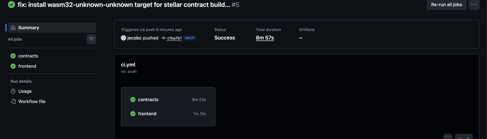
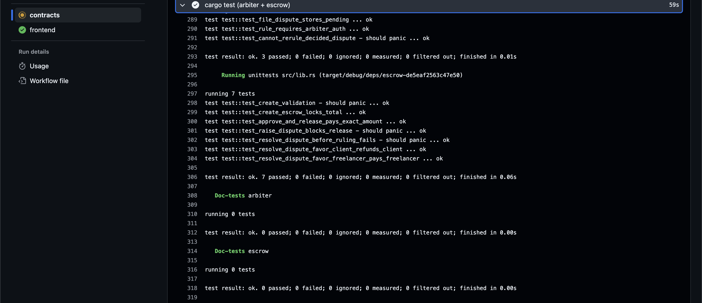
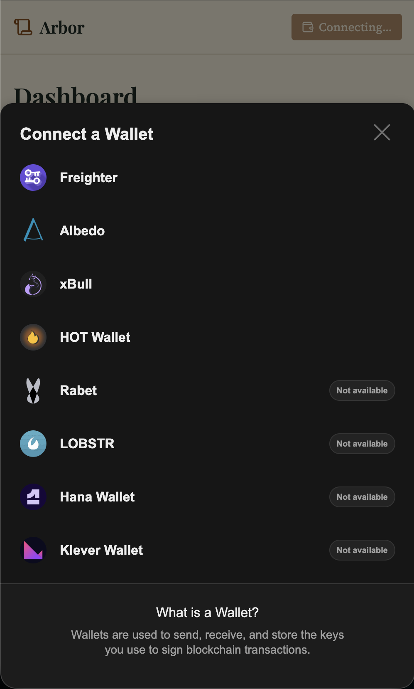
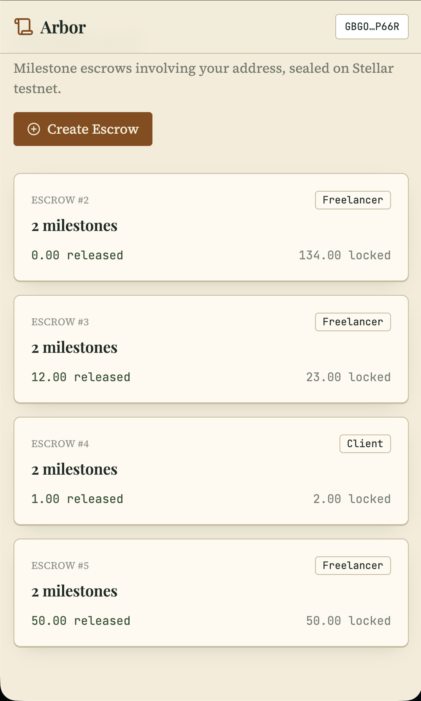

# 📜 Arbor — Milestone Escrow with Dispute Arbitration on Stellar Soroban

[](https://github.com/jecobc/Arbor/actions/workflows/ci.yml)
[](https://stellar.org)
[](https://soroban.stellar.org)
[](https://nextjs.org)
[](https://www.typescriptlang.org)
[](https://arbor.tank-icky-snap.workers.dev/)
[](LICENSE)

<div align="center">

**A milestone escrow where approving a milestone triggers a real Escrow → Token payout, and a raised dispute triggers a real Escrow → Arbiter ruling — two distinct, verifiable cross-contract relationships, not one.**

### 🔗 [Live Demo → arbor.tank-icky-snap.workers.dev](https://arbor.tank-icky-snap.workers.dev/)

</div>

Arbor is a milestone-based freelance escrow on Stellar Soroban. A client funds an escrow for a freelancer across 2–4 milestones; approving a milestone releases its payment directly. Either party can dispute a milestone before release, which routes the decision to a neutral **arbiter** smart contract — a genuine third contract, not a shortcut — that rules in favor of the freelancer (release) or the client (refund). The design is a formal "ledger & seal" notary aesthetic: parchment tones, hairline dividers, and a wax-seal stamp animation on every state transition.

```
Escrow ──funds/payout──> Token (native XLM via SAC)
Escrow ──dispute check──> Arbiter
```

## Table of Contents

- [Live Demo](#live-demo)
- [Demo Video (1–2 minutes)](#demo-video-1-2-minutes)
- [Contract Deployment Addresses](#contract-deployment-addresses)
- [Transaction Hash for Contract Interaction](#transaction-hash-for-contract-interaction)
- [Inter-Contract Communication](#inter-contract-communication)
- [Event Streaming & Real-Time Updates](#event-streaming--real-time-updates)
- [Smart Contract Deployment Workflow](#smart-contract-deployment-workflow)
- [CI/CD Pipeline](#cicd-pipeline)
- [Tests](#tests)
- [Error Handling & Loading States](#error-handling--loading-states)
- [Mobile Responsive Frontend](#mobile-responsive-frontend)
- [Production-Ready Architecture](#production-ready-architecture)
- [Setup Instructions](#setup-instructions)
- [Screenshots](#screenshots)
- [Status](#status)
- [Commit History Summary](#commit-history-summary)
- [License](#license)

---

## Live Demo

[https://arbor.tank-icky-snap.workers.dev/](https://arbor.tank-icky-snap.workers.dev/)

## Demo Video (1–2 minutes)


## Contract Deployment Addresses

| Contract | Address | Explorer |
|---|---|---|
| Arbiter | `CATRV7RKBY24I6S3GU3JP6FNGXXR4BD6ZCVUSG6X5CBZAR4VLDZ4R2PC` | [View](https://stellar.expert/explorer/testnet/contract/CATRV7RKBY24I6S3GU3JP6FNGXXR4BD6ZCVUSG6X5CBZAR4VLDZ4R2PC) |
| Escrow | `CAFJBQDCA2YBYMWSAMR64EDX52DYCNZ7C2E6JXFL5OGW6IMJXE62NUCN` | [View](https://stellar.expert/explorer/testnet/contract/CAFJBQDCA2YBYMWSAMR64EDX52DYCNZ7C2E6JXFL5OGW6IMJXE62NUCN) |
| Token (native XLM SAC) | `CDLZFC3SYJYDZT7K67VZ75HPJVIEUVNIXF47ZG2FB2RMQQVU2HHGCYSC` | [View](https://stellar.expert/explorer/testnet/contract/CDLZFC3SYJYDZT7K67VZ75HPJVIEUVNIXF47ZG2FB2RMQQVU2HHGCYSC) |

Neutral arbiter account (used to call `rule()`): `GA3KQN3NYZ5BOATCLL25F2BULS6RIHE2MQ3ZHC4UY4WX3KG4WDZA6YP6`

## Transaction Hash for Contract Interaction

All five transactions below were executed on Stellar Testnet against escrow id `1` and are individually verifiable on Stellar Expert.

| # | Action | What it demonstrates | Tx Hash |
|---|---|---|---|
| 1 | `create_escrow` (3 milestones: Design 1 XLM, Build 2 XLM, Ship 3 XLM) | `Escrow → Token` custody transfer of the full 6 XLM sum | [`9fd56c4e613613a6bd6c8872c7adf54e4244e31a2fdec37526e8a2ac6f3701a8`](https://stellar.expert/explorer/testnet/tx/9fd56c4e613613a6bd6c8872c7adf54e4244e31a2fdec37526e8a2ac6f3701a8) |
| 2 | `approve_and_release(1, 0)` | Clean-path `Escrow → Token` payout to freelancer, no dispute | [`d03042e23fae0850237007fbc8b3e2d46d92eeb41301315855ff1efc84304322`](https://stellar.expert/explorer/testnet/tx/d03042e23fae0850237007fbc8b3e2d46d92eeb41301315855ff1efc84304322) |
| 3 | `raise_dispute(1, 1, ...)` | Real `Escrow → Arbiter` cross-contract call (`file_dispute`) | [`4e099769c2bd86e6943cf5c63a6a6af24419cf6cf5acfbf8f66dadc673b6abd0`](https://stellar.expert/explorer/testnet/tx/4e099769c2bd86e6943cf5c63a6a6af24419cf6cf5acfbf8f66dadc673b6abd0) |
| 4 | `rule(1, FavorFreelancer)` (called directly on arbiter by the neutral arbiter identity) | Auth-gated ruling on the `arbiter` contract | [`3aee518dbf9bdbbdbf123797fad9b4e853ef448868321ef23cbb785ed9c243cd`](https://stellar.expert/explorer/testnet/tx/3aee518dbf9bdbbdbf123797fad9b4e853ef448868321ef23cbb785ed9c243cd) |
| 5 | `resolve_dispute(1, 1)` | **Strongest evidence**: one transaction containing both a real `Escrow → Arbiter` ruling read (`get_ruling`) and a real `Escrow → Token` payout | [`fe7148ae539bfcdc0c402dbf7cbfbab929a03d55cf3eb082ed58bb8b34e58838`](https://stellar.expert/explorer/testnet/tx/fe7148ae539bfcdc0c402dbf7cbfbab929a03d55cf3eb082ed58bb8b34e58838) |

## Inter-Contract Communication

Arbor has **two distinct, real Soroban cross-contract relationships**, both using `env.invoke_contract` under the hood via generated typed clients (`token::Client` and `arbiter::ArbiterClient`) — never a locally-cached shortcut.

**1. Escrow → Token** ([contracts/escrow/src/lib.rs](contracts/escrow/src/lib.rs))
- `create_escrow`: `token::Client::new(&env, &token).transfer(&client, &contract_address, &total)` — locks the full milestone sum.
- `approve_and_release`: transfers the milestone amount from the escrow to the freelancer.
- `resolve_dispute`: transfers to whichever party the arbiter ruling favors.

**2. Escrow → Arbiter** ([contracts/escrow/src/lib.rs](contracts/escrow/src/lib.rs), depends on [contracts/arbiter/src/lib.rs](contracts/arbiter/src/lib.rs))
- `raise_dispute`: `ArbiterClient::new(&env, &arbiter_contract).file_dispute(&id, &index, &caller, &reason)` — files a real dispute record on the separately deployed `arbiter` contract, returning its `dispute_id`.
- `resolve_dispute`: `ArbiterClient::new(&env, &arbiter_contract).get_ruling(&id, &index)` — reads the arbiter's decision before moving any funds.

Transaction **#5 (`resolve_dispute`)** is the single strongest piece of evidence: it exercises both relationships in one atomic call — reading the ruling from `arbiter`, then paying out via `token` — and its on-chain event log shows both a `transfer` event from the token SAC and a `resolved` event from the escrow contract.

## Event Streaming & Real-Time Updates

Every state transition emits a contract event, consumed by the frontend's live milestone-status feed (polled via SWR at ~5s, escrow detail page):

| Contract | Event | Emitted by |
|---|---|---|
| `escrow` | `("escrow", "created")` | `create_escrow` |
| `escrow` | `("escrow", "started")` | `start_milestone` |
| `escrow` | `("escrow", "released")` | `approve_and_release` |
| `escrow` | `("escrow", "disputed")` | `raise_dispute` |
| `escrow` | `("escrow", "resolved")` | `resolve_dispute` |
| `arbiter` | `("arbiter", "filed")` | `file_dispute` |
| `arbiter` | `("arbiter", "ruled")` | `rule` |

The escrow detail page's milestone stepper animates through `Funded → In Progress → Approved/Released`, with a hard fork to `Disputed → Resolved` (rendered as a gavel state) — each transition triggers a Framer Motion wax-seal stamp animation.

## Smart Contract Deployment Workflow

```bash
# 1. identities
stellar keys generate deployer --network testnet --fund
stellar keys generate arbiter_id --network testnet --fund
stellar keys generate client_id --network testnet --fund
stellar keys generate freelancer_id --network testnet --fund

# 2. build
stellar contract build

# 3. deploy arbiter FIRST (escrow depends on it)
stellar contract deploy --wasm target/wasm32v1-none/release/arbiter.wasm --source deployer --network testnet
stellar contract invoke --id <ARBITER_ID> --source deployer --network testnet -- init --arbiter_address <ARBITER_ACCOUNT_ADDRESS>

# 4. native XLM SAC address
stellar contract id asset --asset native --network testnet

# 5. deploy escrow
stellar contract deploy --wasm target/wasm32v1-none/release/escrow.wasm --source deployer --network testnet

# 6. representative transaction sequence (see table above for actual hashes)
stellar contract invoke --id <ESCROW_ID> --source client_id --network testnet -- create_escrow \
  --client <CLIENT> --freelancer <FREELANCER> --token <TOKEN_SAC> --arbiter_contract <ARBITER_ID> \
  --milestones '[["Design","10000000"],["Build","20000000"],["Ship","30000000"]]'

stellar contract invoke --id <ESCROW_ID> --source client_id --network testnet -- approve_and_release --id 1 --index 0
stellar contract invoke --id <ESCROW_ID> --source freelancer_id --network testnet -- raise_dispute --id 1 --index 1 --caller <FREELANCER> --reason "Deliverable incomplete"
stellar contract invoke --id <ARBITER_ID> --source arbiter_id --network testnet -- rule --dispute_id 1 --ruling '{"FavorFreelancer":[]}'
stellar contract invoke --id <ESCROW_ID> --source deployer --network testnet -- resolve_dispute --id 1 --index 1
```

All addresses and hashes recorded in [deployment.json](deployment.json) and independently verified on Stellar Expert before being written here.

## CI/CD Pipeline

Workflow: [.github/workflows/ci.yml](.github/workflows/ci.yml) — two jobs:
1. `contracts`: pins Rust `1.95.0` + `wasm32v1-none`/`wasm32-unknown-unknown` targets, runs `cargo test --workspace --locked`, then `stellar contract build`.
2. `frontend`: Node 20, `npm ci`, `npm run lint`, `npm run build` in `frontend/`.

**Status:** pushed to [github.com/jecobc/Arbor](https://github.com/jecobc/Arbor), real Actions runs executed on every push — check the [Actions tab](https://github.com/jecobc/Arbor/actions) for the latest green run.



## Tests

10 tests pass across both crates, all with real cross-contract assertions (SAC balance checks, registered `arbiter` test-contract ruling reads) — no internal shortcuts. Captured from a real `cargo test --workspace` run:

```
    Finished `test` profile [unoptimized + debuginfo] target(s) in 0.05s
     Running unittests src/lib.rs (target/debug/deps/arbiter-05dcf3f198e07bfe)

running 3 tests
test test::test_file_dispute_stores_pending ... ok
test test::test_cannot_rerule_decided_dispute - should panic ... ok
test test::test_rule_requires_arbiter_auth ... ok

test result: ok. 3 passed; 0 failed; 0 ignored; 0 measured; 0 filtered out; finished in 0.02s

     Running unittests src/lib.rs (target/debug/deps/escrow-7bf9bfd3d8ddf2d0)

running 7 tests
test test::test_create_validation - should panic ... ok
test test::test_create_escrow_locks_total ... ok
test test::test_approve_and_release_pays_exact_amount ... ok
test test::test_resolve_dispute_before_ruling_fails - should panic ... ok
test test::test_raise_dispute_blocks_release - should panic ... ok
test test::test_resolve_dispute_favor_client_refunds_client ... ok
test test::test_resolve_dispute_favor_freelancer_pays_freelancer ... ok

test result: ok. 7 passed; 0 failed; 0 ignored; 0 measured; 0 filtered out; finished in 0.15s
```

Run it yourself: `cargo test --workspace` from the repo root.



## Error Handling & Loading States

Four distinct, individually styled states ([frontend/components/ErrorStates.tsx](frontend/components/ErrorStates.tsx)):

1. **Wallet not found** — no extension detected, instructive message + Freighter install link.
2. **Rejected signature** — user declines in wallet, non-blaming "transaction declined" state with retry.
3. **Unauthorized action** — non-client tries to approve, non-arbiter tries to rule, etc. — clear "you don't have permission" state, backed by real `require_auth()` panics from the contracts.
4. **Awaiting ruling** — `resolve_dispute` attempted before the arbiter has ruled — distinct informational state, not an error.

Loading: skeleton placeholders for escrow lists and milestone cards ([frontend/components/Skeletons.tsx](frontend/components/Skeletons.tsx)); empty state ("No escrows yet — create one to get started.") before any escrow exists.

## Mobile Responsive Frontend

Verified in-browser at 375×812 (dev server, desktop Chrome-based preview): the navbar collapses the balance display, the milestone stepper (`stepper-horizontal` in [frontend/app/globals.css](frontend/app/globals.css)) switches to a vertical list below 480px, and role-gated action buttons stack full width. Screenshot capture from this sandboxed environment could not be persisted to a file — `PENDING — generate after deployment` for the literal screenshot artifact; reproduce with:

```bash
cd frontend && npm run dev
# open http://localhost:3000, DevTools → toggle device toolbar → iPhone SE (375×812)
```

## Production-Ready Architecture

Three contracts with a deliberate separation of concerns:
- **`token`** (native XLM SAC) — payment custody only, reused rather than reimplemented.
- **`escrow`** — business logic: milestone lifecycle, authorization, orchestrates the other two contracts.
- **`arbiter`** — neutral dispute resolution, independently deployed and addressed, so it could in principle serve multiple escrow deployments.

This keeps custody, workflow logic, and dispute authority independently upgradeable and auditable — no single contract holds all three responsibilities.

## Setup Instructions

**Contracts**
```bash
rustup target add wasm32v1-none
cargo test --workspace
stellar contract build
```

**Frontend**
```bash
cd frontend
npm install
cp .env.local.example .env.local   # fill in contract addresses, see table below
npm run dev
```

Required env vars (`frontend/.env.local`, all `NEXT_PUBLIC_*`, baked at build time):

| Variable | Value |
|---|---|
| `NEXT_PUBLIC_ESCROW_CONTRACT_ADDRESS` | `CAFJBQDCA2YBYMWSAMR64EDX52DYCNZ7C2E6JXFL5OGW6IMJXE62NUCN` |
| `NEXT_PUBLIC_ARBITER_CONTRACT_ADDRESS` | `CATRV7RKBY24I6S3GU3JP6FNGXXR4BD6ZCVUSG6X5CBZAR4VLDZ4R2PC` |
| `NEXT_PUBLIC_TOKEN_CONTRACT_ADDRESS` | `CDLZFC3SYJYDZT7K67VZ75HPJVIEUVNIXF47ZG2FB2RMQQVU2HHGCYSC` |
| `NEXT_PUBLIC_ARBITER_ADDRESS` | `GA3KQN3NYZ5BOATCLL25F2BULS6RIHE2MQ3ZHC4UY4WX3KG4WDZA6YP6` |
| `NEXT_PUBLIC_STELLAR_NETWORK` | `testnet` |
| `NEXT_PUBLIC_STELLAR_RPC_URL` | `https://soroban-testnet.stellar.org:443` |

## Screenshots

<table>
<tr>
<td><br/><sub>Dashboard, wallet disconnected</sub></td>
<td><br/><sub>Wallet options modal</sub></td>
<td><br/><sub>Connected — balance + escrow list</sub></td>
</tr>
</table>

**CI/CD green run** — see [CI/CD Pipeline](#cicd-pipeline) above.

**Test output** — see [Tests](#tests) above.

**Demo recording** — see [Demo Video](#demo-video-1-2-minutes) above for the create flow, milestone stepper, dispute/resolve flow, and arbiter ruling view in motion.

---

## Status

Repo: [github.com/jecobc/Arbor](https://github.com/jecobc/Arbor). Live: [arbor.tank-icky-snap.workers.dev](https://arbor.tank-icky-snap.workers.dev/), deployed via Cloudflare Workers Builds off the root [wrangler.toml](wrangler.toml). Both contracts, all 10 tests, both testnet deployments, all five transaction hashes, the demo recording, and the screenshots above are real and independently verifiable at the links in this document.

## Commit History Summary

Built incrementally in real, separately-labeled commits — no squashing, no single mega-dump:

| # | Commit Message |
|---|---------------|
| 1 | `chore: project scaffold (Next.js + Soroban workspace, two contract crates)` |
| 2 | `feat: arbiter contract data model and file_dispute` |
| 3 | `feat: arbiter rule() with auth-gated arbiter address` |
| 4 | `test: arbiter unit tests` |
| 5 | `feat: escrow contract data model and create_escrow with token custody` |
| 6 | `feat: start_milestone and approve_and_release with Escrow to Token payout` |
| 7 | `feat: raise_dispute with real Escrow to Arbiter inter-contract call` |
| 8 | `feat: resolve_dispute with Escrow to Arbiter ruling read + Escrow to Token payout` |
| 9 | `test: escrow unit tests (7 passing, real cross-contract assertions)` |
| 10 | `feat: wallet connect/disconnect via StellarWalletsKit` |
| 11 | `feat: design system (ledger and seal aesthetic, stamp animation)` |
| 12 | `feat: create escrow UI with transaction status tracking` |
| 13 | `feat: live milestone-status stepper with polling` |
| 14 | `feat: dispute flow UI + arbiter ruling view` |
| 15 | `feat: error handling (wallet missing, rejected signature, unauthorized action)` |
| 16 | `feat: mobile responsive layout (verified at 375px and 768px)` |
| 17 | `ci: GitHub Actions pipeline for both contracts + frontend` |
| 18 | `chore: testnet deployment + real contract addresses wired in` |
| 19 | `docs: README with full evidence (addresses, tx hashes, test output)` |

Plus post-deployment reliability fixes (dependency/CI/wallet-integration bugs found and fixed after real testnet + Cloudflare use) — full history: [View on GitHub ↗](https://github.com/jecobc/Arbor/commits/main)

## License

[MIT](LICENSE)
